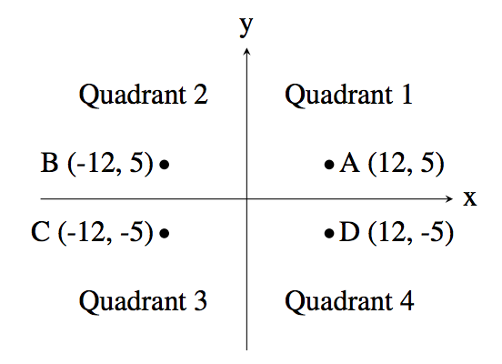

# 14681. 사분면 고르기 
🔗 [백준 문제 링크](https://www.acmicpc.net/problem/14681)

## 문제 설명
- 점의 좌표를 입력받아 그 점이 어느 사분면에 속하는지 알아내는 프로그램을 작성하시오. 단, x좌표와 y좌표는 모두 양수나 음수라고 가정한다.

## 입력
- 첫 줄에는 정수 x가 주어진다. (−1000 ≤ x ≤ 1000; x ≠ 0) 다음 줄에는 정수 y가 주어진다. (−1000 ≤ y ≤ 1000; y ≠ 0)
## 출력
- 점 (x, y)의 사분면 번호(1, 2, 3, 4 중 하나)를 출력한다.
## 문제 분류
- 수학
- 구현
- 조건문
## 성능 요약
- 메모리: 17712 KB
- 시간: 172 ms
## 제출 시간
- 2025년 5월 13일 22:08:50